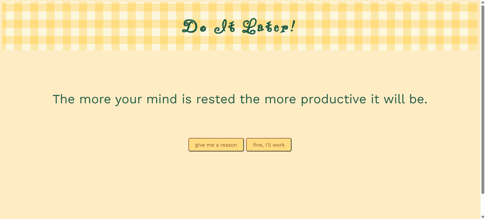

# Do It Later!

Do It Later! is a a randomizer to help you reason why you should put something off. I decided to procrastinate by building this instead of studying for exams (oh, the irony). Use it when you're stalling or use it when you need motivation. 

# Built With

- Plain HTML5
- Pure CSS3
- Vanilla JavaScript

# Demo



# Getting Started

Open the URL: https://ctln-d.github.io/do-it-later/ 

# Contributing

## Cloning and Installation
1. Fork this repository on GitHub.
2. From your fork, run
```
git clone https://github.com/<your-username>/do-it-later  
cd do-it-later
```
## Making Contributions
- Make sure to create a new branch and name it adequately
- Write clear commit messages
- When pushing changes, open a pull request and describe the changes made

# Credits

- [Tartan plaid scottish pattern in yellow and white cage](https://www.vecteezy.com/vector-art/8864772-tartan-plaid-scottish-pattern-in-yellow-and-white-cage") by [Mayura Posrisoong](https://www.vecteezy.com/members/myurapoo338993)  
- [Arcade button 1 click sound.mp3](https://freesound.org/s/157871/) from [Freesound](https://freesound.org/)  
